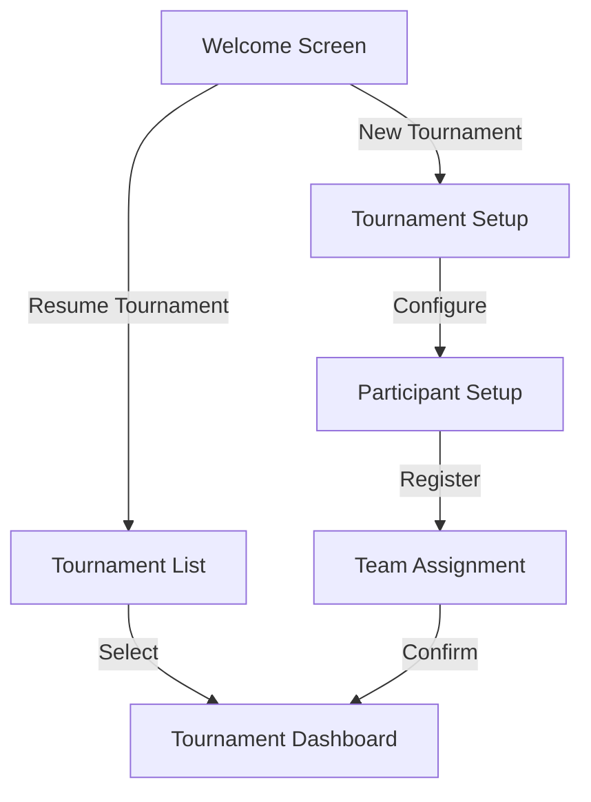
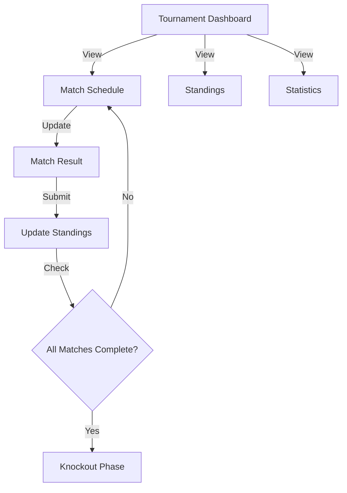

# Tournament Manager UI/UX Specifications

## Design System

### Color Palette
```
Primary Colors:
- Primary: #2563eb (Blue)
- Secondary: #475569 (Slate)
- Accent: #f59e0b (Amber)

Semantic Colors:
- Success: #22c55e (Green)
- Warning: #f59e0b (Amber)
- Error: #ef4444 (Red)
- Info: #3b82f6 (Blue)

Neutral Colors:
- Background: #f8fafc
- Surface: #ffffff
- Text Primary: #0f172a
- Text Secondary: #475569
```

### Typography
```
Font Families:
- Primary: Inter
- Monospace: JetBrains Mono

Font Sizes:
- xs: 0.75rem (12px)
- sm: 0.875rem (14px)
- base: 1rem (16px)
- lg: 1.125rem (18px)
- xl: 1.25rem (20px)
- 2xl: 1.5rem (24px)
- 3xl: 1.875rem (30px)
- 4xl: 2.25rem (36px)
```

### Component Library
Based on shadcn/ui with custom extensions:

1. Core Components:
   - Button (Primary, Secondary, Ghost, Destructive)
   - Input (Text, Number, Date)
   - Select
   - Card
   - Table
   - Dialog
   - Alert
   - Toast

2. Custom Components:
   - TournamentCard
   - MatchCard
   - StandingsTable
   - TeamAssignmentGrid
   - BracketVisualizer
   - StatisticsCard

## Screen Flows

### 1. Welcome Flow


### 2. Tournament Flow


## Screen Specifications

### 1. Welcome Screen
- Hero section with tournament logo
- Two primary action buttons (New/Resume)
- Recent tournaments list (if any)
- Quick stats overview

### 2. Tournament Setup
- Step indicator
- Configuration form
- Real-time validation
- Preview panel

### 3. Tournament Dashboard
```
Layout:
+------------------------+
|        Header         |
+--------+-------------+
| Nav    | Main Content|
| Bar    |             |
|        |             |
|        |             |
+--------+-------------+
|        Footer        |
+------------------------+
```

Components:
- Tournament status card
- Quick actions panel
- Match schedule widget
- Standings summary
- Recent activity feed

### 4. Match Management
- Match card grid
- Result entry form
- Validation rules
- Status indicators
- Match statistics

### 5. Standings View
- Sortable table
- Stat columns
- Team filters
- Export options
- Visual indicators

### 6. Knockout Bracket
- Interactive bracket
- Match details
- Progress indicators
- Winner highlighting

## Responsive Design Breakpoints
```css
/* Mobile First Approach */
- Base: 0-639px
- sm: 640px-767px
- md: 768px-1023px
- lg: 1024px-1279px
- xl: 1280px-1535px
- 2xl: 1536px+
```

## Interaction Patterns

### 1. Data Entry
- Real-time validation
- Instant feedback
- Error prevention
- Auto-save
- Undo/redo support

### 2. Navigation
- Breadcrumb trail
- Step indicators
- Progress tracking
- Context preservation
- Back navigation

### 3. Status Updates
- Toast notifications
- Progress indicators
- Status badges
- Loading states
- Error states

## Accessibility Guidelines
1. WCAG 2.1 AA Compliance
2. Keyboard navigation
3. Screen reader support
4. Color contrast requirements
5. Focus management
6. Aria labels and roles
